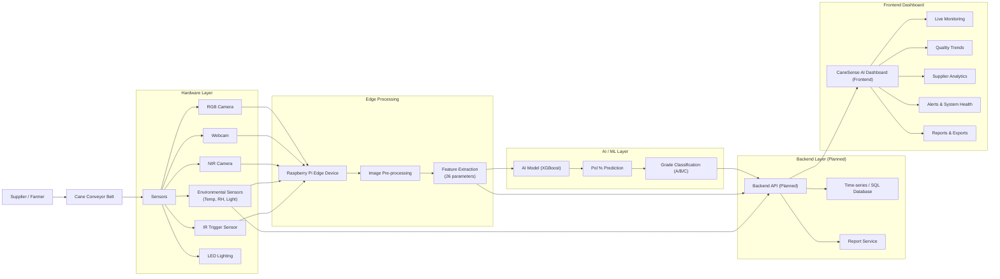
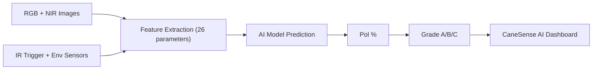
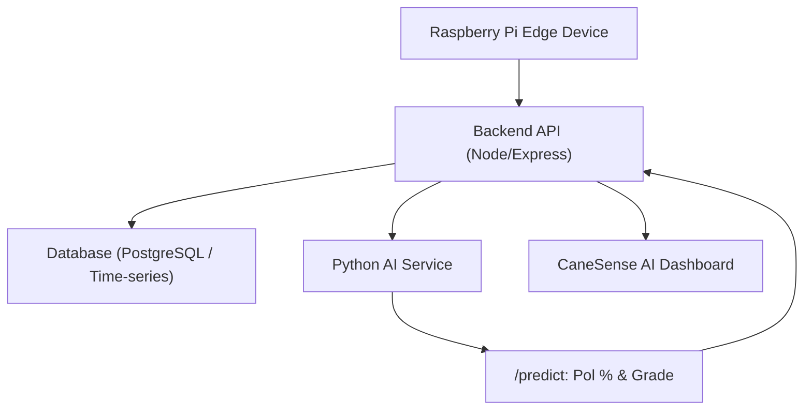
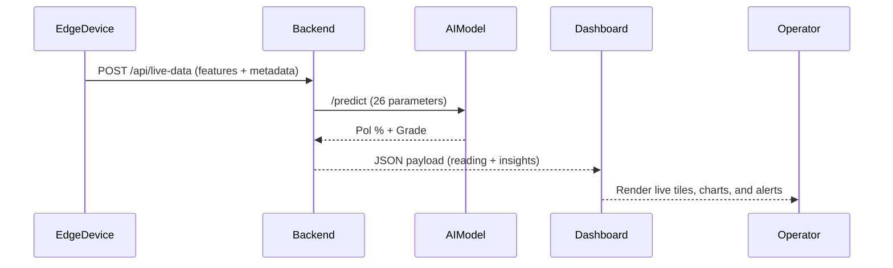

# CaneSense AI

AI-powered real-time sugarcane quality monitoring system for sugar mills.  
**Goal:** Turn raw cane on the conveyor into live, explainable quality insights (Pol % and grade) for mill operators.

## Project Overview

| Component | Description |
| --------- | ----------- |
| **Problem** | Sugar mills lack continuous, objective, real-time measurement of incoming cane quality. |
| **Solution** | Edge AI + Computer Vision + IoT sensors streaming into a unified monitoring dashboard. |
| **Output** | Predicted Pol % (sucrose content), Quality Grade (A/B/C), supplier performance, alerts, and reports. |
| **Users** | Mill operators, quality control teams, plant managers, and data/AI engineers. |

## End-to-End System Architecture



## Hardware Stack

| Component | Role |
| --------- | ---- |
| **Raspberry Pi 5** | Edge inference device; runs capture, feature extraction, and calls the AI model. |
| **RGB Camera** | High-resolution surface inspection of cane billets. |
| **Webcam** | Auxiliary image acquisition / alignment view. |
| **NIR Camera** | Near-Infrared spectral analysis correlated with sucrose content. |
| **IR Trigger Sensor** | Detects cane presence on the conveyor to synchronize capture. |
| **LED Lighting** | Provides stable, controlled illumination for consistent images. |
| **Environmental Sensors** | Measure ambient temperature, humidity, and light. |
| **Conveyor Mount** | Fixed, repeatable camera + sensor positioning above the belt. |

## AI Model

### Feature Groups (26 Inputs)

| Category | Examples |
| -------- | -------- |
| **Multispectral** | NIR reflectance, Red-edge reflectance, Green/Blue reflectance, Thermal emissivity, Moisture index. |
| **RGB Vision** | R/G/B channel means, Hue, Saturation, Defect score, Rot presence, Maturity grade, Node length, Cane length. |
| **Environmental** | Ambient temperature, Relative humidity, Ambient light, Time since harvest, Season month. |
| **Process** | Conveyor speed, Batch weight. |
| **Metadata** | Supplier ID, Cane variety, Field zone. |

### Model Summary

| Item | Value |
| ---- | ----- |
| **Model** | Gradient-boosted tree model (XGBoost-style regressor, planned training pipeline). |
| **Target** | Pol % (sucrose content estimation per batch). |
| **Aux Output** | Quality Grade A/B/C derived from Pol %. |

### Grade Mapping

| Grade | Pol % Range |
| ----- | ----------- |
| **A** | ≥ 18 |
| **B** | 14 – 18 |
| **C** | \< 14 |

## ML Pipeline



## Frontend Dashboard (Current Implementation)

### Modules

| Module | Purpose |
| ------ | ------- |
| **Live Monitoring** | Real-time Pol %, grade, sensor health, and latest 10 batch readings. |
| **Quality Trends** | Time-windowed Pol % trends, grade distribution, and hourly heatmap. |
| **Supplier Analytics** | Supplier-wise averages, grade distribution, rankings, and multi-day comparison. |
| **Alerts & System Health** | Alert feed with severity, acknowledgements, and sensor/RPi health overview. |
| **Reports** | Shift, daily, supplier, and alert summary reports (mocked endpoints, UI-ready). |

### Frontend Tech Stack

| Technology | Purpose |
| ---------- | ------- |
| **React + TypeScript (Vite)** | Modern SPA architecture and type-safe UI. |
| **Tailwind CSS** | Utility-first styling for a clean dark industrial UI. |
| **shadcn/ui + Radix** | Accessible, composable UI primitives (dialogs, tables, toasts). |
| **Recharts** | Charts for trends, distributions, heatmaps, and supplier analytics. |
| **TanStack Query (planned)** | Server-state management for API integration. |

## Backend Architecture (Planned)

### Backend Stack (Planned)

| Component | Role |
| --------- | ---- |
| **Node.js + Express** | Primary REST API surface for frontend and edge devices. |
| **Python AI Service (optional)** | Hosts trained ML model, exposes `/predict` endpoint. |
| **PostgreSQL / TimescaleDB** | Historical storage of readings, alerts, and reports. |
| **Message Queue (Kafka / MQTT)** | Optional streaming for high-throughput sensor data. |

### Backend Architecture Diagram



## API Endpoints (Designed)

| Endpoint | Method | Purpose |
| -------- | ------ | ------- |
| `/api/live-data` | GET | Stream most recent cane reading (Pol %, grade, sensor snapshot). |
| `/api/trends` | GET | Historical Pol % and grade series for trends view. |
| `/api/suppliers` | GET | Aggregated supplier-level analytics and rankings. |
| `/api/alerts` | GET | Active and historical system alerts. |
| `/api/health` | GET | Health status for cameras, edge device, and environment. |
| `/generate-shift-report` | POST | Generate shift-level PDF/CSV report. |
| `/generate-daily-report` | POST | Generate daily operations report. |
| `/generate-supplier-report` | POST | Generate supplier quality report. |
| `/generate-alert-summary` | POST | Generate alert summary report for a time range. |

## Data Flow (Request/Response)



## Project Structure (Frontend)

```text
src/
  components/
    PolGauge.tsx            # Semi-circular Pol % gauge
    SensorHealthPanel.tsx   # Sensor & system health status
    DashboardLayout.tsx     # Shell with sidebar navigation
    ui/                     # shadcn/ui primitives
  pages/
    LiveMonitoring.tsx      # Real-time readings and batch explainability
    QualityTrends.tsx       # Line charts, grade donut, heatmap
    SupplierAnalytics.tsx   # Supplier KPIs, tables, multi-day comparison
    AlertsHealth.tsx        # Alert feed + sensor/system status
    Reports.tsx             # Report generation and history
  hooks/
    use-toast.ts            # Toast notifications
  lib/
    mockData.ts             # Mock generators + endpoint definitions
    utils.ts                # Utilities (e.g., className helpers)
  test/
    example.test.ts         # Sample tests / setup
public/
  index.html                # App entry shell
```

## Future Work

- **Edge Deployment:** Package the trained model and feature pipeline for Raspberry Pi (Python + ONNX/TVM).  
- **Real Hardware Integration:** Connect real RGB/NIR cameras, IR trigger, and environmental sensors.  
- **Backend Services:** Implement Node.js APIs, auth, and data retention policies.  
- **Persistent Storage:** Store all readings, alerts, and reports in a production database.  
- **Real-time Streaming:** Add WebSocket or SSE channel for sub-second dashboard updates.  
- **Model Lifecycle:** Add training scripts, experiment tracking, and model versioning.  
- **Operator UX:** Add filters, bookmarks, and “what-if” tools for explainability.  


